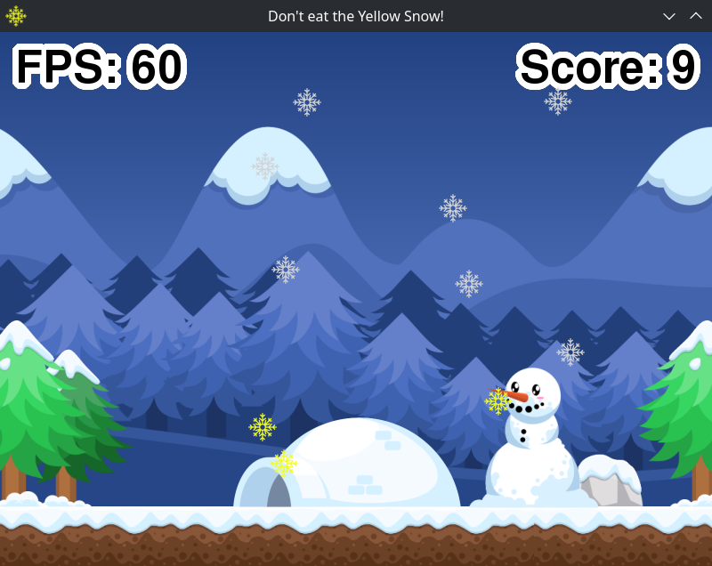

# ShellGame (SDL2)
ShellGame is an SDL2 to Shell bridge for making games in the Shell. It uses an SDL2 game engine server written in C. There are multiple options for starting that server and establishing communication. Simply source one of those scripts and start writing your game. ShellGame works in Linux and MacOS, using Bash or zsh. The communication backends are --pipe, --stdinout, --socket, --shared(Linux only), --client(Linux only). Shared is much slower and client is 100 times slower.





## Install on archlinux
Install sdl2 and friends.
```
sudo pacman -S sdl2 sdl2_image sdl2_mixer sdl2_ttf
```
Clone ShellGame-SDL2 repo.
```
cd
git clone https://github.com/ProgrammingRainbow/ShellGame-SDL2
```
Build ShellGame server.
```
cd ShellGame-SDL2
make -C sg-server release
```
Optional but very slow client.
```
make -C sg-client release
```
Try out an example using the named pipe backend.
```
bash examples/yellow-snow.sh --pipe
```

---

## Install on MacOS
Install sdl2 and friends. For the socket backend install socat too.
```
brew install sdl2 sdl2_image sdl2_mixer sdl2_ttf socat
```
Clone ShellGame-SDL2 repo.
```
cd
git clone https://github.com/ProgrammingRainbow/ShellGame-SDL2
```
Build ShellGame server.
There currently is a bug in sdl2. if it doesn't compile with my strict rules try running make without release.
```
cd ShellGame-SDL2
make -C sg-server release
```
Try out an example using the named pipe backend.
```
zsh examples/yellow-snow.sh --pipe
```

---

## ShellGame Usage
- One of the server scripts must be sourced to start the server, establish communication, and define the sg_cmd function.
- All commands listed below are passed as a string to the sg_cmd function.
- The symbols <> represent single replacements such as variables. {} represent arrays or space separated variables.
- All `set` commands are actions and return nothing.
- `get` commands return a single value via the global `$reply` variable. That value will need to be saved in another variable.
- `arr` commands return multiple values via the global `$array` variable. This array will need to be saved in another array or variables.

## Simple Example
This opens a window using the pipe backend. It loads a background image as a sprite. If the window is closed or escape is pressed it exits.
```bash
#!/usr/bin/env bash

# Source the Pipe backend.
source pipe.sh || exit 1

# Start ShellGame.
sg_cmd "start sg"

# Set the title to ShellGame.
sg_cmd "set sg title ShellGame"

# Load the background image as a sprite.
sg_cmd "new sprite examples/images/background.png"
# Save the returned sprt_id to back_sprt variable.
back_sprt=$reply

# Main game loop.
while true; do
    # 'update sg' must be called at the top of the game loop.
    sg_cmd "update sg"

    # If esc key is pressed exit.
    sg_cmd "get key pressed esc"
    (( reply )) && sg_quit 0

    # Clear the game renderer.
    sg_cmd "set render clear"

    # Draw the background sprite.
    sg_cmd "draw sprite $back_sprt"

    # Present the renderer.
    sg_cmd "set render present"
done

# If exectution gets this far shut down.
sg_quit 0
```
---

## ShellGame Core Commands

| Command                          | Description |
|----------------------------------|-------------|
| `start sg`                       | Initializes the ShellGame engine. Must be called before any other commands. |
| `update sg`                      | Updates the engine state. Must be the first call inside the game loop. |
| `quit sg`                        | Gracefully shuts down the engine and exits the game. |

---

## ShellGame Window Commands

| Command                                | Description |
|----------------------------------------|-------------|
| `set sg title <string>`                | Sets the window title to the specified string.  |
| `set sg icon <filename>`               | Sets the window icon using the given image file. |
| `set sg size <width> <height>`         | Sets the window dimensions. |
| `set sg fullscreen enable`             | Enables fullscreen mode. |
| `set sg fullscreen disable`            | Disables fullscreen mode. |
| `set sg fullscreen toggle`             | Toggles between fullscreen and windowed mode. |
| `get sg width` → `<int>`               | Retrieves the current window width. |
| `get sg height` → `<int>`              | Retrieves the current window height. |
| `arr sg size` → `{int array}`          | Returns an array with `[width, height]` values. |

---

## ShellGame Image Scaling Style
These settings are applied to new or updated images/sprites/text. Not existing ones.
| Command                                | Description |
|----------------------------------------|-------------|
| `set sg scaling nearest`               | Sets pixel scaling to nearest for pixel art style. |
| `set sg scaling linear`                | Sets pixel scaling to linear for smooth style. |

---

## ShellGame FPS Commands

| Command                   | Description |
|---------------------------|-------------|
| `set sg fps <int>`        | Sets the target frames per second. |
| `get sg fps` → `<int>`    | Retrieves the current frame rate. Updated every second. |

---

## Render Commands
All drawing should be done between these commands.
| Command                   | Description |
|---------------------------|-------------|
| `set render clear`        | Clear the ShellGame renderer. |
| `set render present`      | Present the ShellGame renderer. |

---

## Key Commands

| Command                                              | Description |
|------------------------------------------------------|-------------|
| `get key (h,held) <key>` → `<bool>`                  | Returns if a key is held. |
| `get key (p,pressed) <key>` → `<bool>`               | Returns if a key was pressed. |
| `get key (r,released) <key>` → `<bool>`              | Returns if a key was released. |
| `arr key (h,held) {key array}` → `{bool array}`      | Returns an array of bools for a space separated array of keys held. |
| `arr key (p,pressed) {key array}` → `{bool array}`   | Returns an array of bools for a space separated array of keys pressed. |
| `arr key (r,released) {key array}` → `{bool array}`  | Returns an array of bools for a space separated array of keys released. |

---

## Mouse Commands

| Command                                                   | Description |
|-----------------------------------------------------------|-------------|
| `get mouse (x,y)` → `<int>`                               | Returns the x or y mouse position. |
| `get mouse (h,held) <button>` → `<bool>`                  | Returns if a mouse button is held. |
| `get mouse (p,pressed) <button>` → `<bool>`               | Returns if a mouse button is pressed. |
| `get mouse (r,released) <button>` → `<bool>`              | Returns if a mouse button is released. |
| `arr mouse (h,held) {button array}` → `{bool array}`      | Returns an array of bools for a space separated array of mouse buttons held. |
| `arr mouse (p,pressed) {button array}` → `{bool array}`   | Returns an array of bools for a space separated array of mouse buttons pressed. |
| `arr mouse (r,released) {button array}` → `{bool array}`  | Returns an array of bools for a space separated array of mouse buttons released. |
| `arr mouse pos` → `{int array}`                           | Returns an array `[x,y]` of the mouse position. |

---

## Creating new ShellGame objects.

| Command                                         | Description |
|-------------------------------------------------|-------------|
| `new image <filename>` → `<img_id>`             | Creates an image object from an image file. |
| `new rect` → `<rect_id>`                        | Creates a rect object with `[x,y,w,h]` all set to zero. |
| `new rect image <img_id>` → `<rect_id>`         | Creates a rect object with and height populated from an image. |
| `new rect <x> <y> <w> <h>` → `<rect_id>`        | Creates a rect object with position and size set. |
| `new sprite <filename>` → `<sprt_id>`           | Creates a new sprite object from an image file. |
| `new text <font> <size> <string>` → `<txt_id>`  | Creates a text object with font, size, and a string. |
| `new music <filename>` → `<mus_id>`             | Creates a music object from a music file. |
| `new sound <filename>` → `<snd_id>`             | Creates a sound object from a sound file. |

---

## Free/Delete Objects
This command works with all ShellGame object <type>.
| Command                                  | Description |
|------------------------------------------|-------------|
| `free <type> {id array}` → `{id array}`  | Frees each object and returns an array their rest ids. |


---

## Text objects
Text objects have there own rect and angle. All commands like update, set, or get work with text objects.
All commands apply immediatly to the text object. Setting a new font will cause the internal texture to be regenerated.
| Command                                         | Description |
|-------------------------------------------------|-------------|
| `new text <font> <size> <string>` → `<txt_id>`  | Creates a text object with font, size, and a string. |
| `draw text {txt_id array}`                      | Draws a text object using it own rect and angle. Applies to each space separated id. | 
| `set text string <txt_id> <string>`             | Sets a string for a text object. Everything after the id will be the string. |
| `set text font <txt_id> <font> <size>`          | Sets the font and size of a text object. |
| `set text color <txt_id> <r> <g> <b>`           | Sets the color of a text object. |
| `set text color <txt_id> <r> <g> <b> <a>`       | Same as above but with an alpha option. |
| `free <type> {id array}` → `{id array}`         | Frees each object and returns an array of their rest ids. |

---

## Sprite Objects

| Command                                            | Description |
|----------------------------------------------------|-------------|
| `new sprite <filename>` → `<sprt_id>`              | Creates a new sprite object from an image file. |
| `draw sprite {sprt_id array}`                      | Draws a sprite object using it own rect and angle. Applies to each space separated id. |
| `set sprite image <filename> {sprt_id array}`      | Sets the sprite to the new image filename. |
| `free sprite {sprt_id array}` → `{sprt_id array}`  | Frees each object and returns an array of their rest ids. |

---

## Image Objects

| Command                                                        | Description |
|----------------------------------------------------------------|-------------|
| `new image <filename>` → `<img_id>`                            | Creates a new image object from an image file. |
| `draw image <src_id> <dest_id> {img_id array}`                 | Draws an image object using source and destination rect objects. Optionally NULL can be used for the source rect id. Applies to all space separated image ids. |
| `set image <filename> {img_id array}`                          | Sets the image to the new image filename. |
| `get image <attribute> <img_id>` → `<int>`                     | Gets a single attribute (w,width,h,height) from an image id. | 
| `arr image size <img_id>` → `{int array}`                      | Returns an array `[w,h]` for an image id.
| `arr image <attribute> {img_id array}` → `{int array}`         | Returns an array of attribute (w,width,h,height) for each space separated image id. |
| `free image {img_id array}` → `{img_id array}`                 | Frees each object and returns an array of their rest ids. |

---

## Rect Objects

| Command                                          | Description |
|--------------------------------------------------|-------------|
| `new rect` → `<rect_id>`                         | Creates a rect object with `[x,y,w,h]` all set to zero. |
| `new rect image <img_id>` → `<rect_id>`          | Creates a rect object with and height populated from an image. |
| `new rect <x> <y> <w> <h>` → `<rect_id>`         | Creates a rect object with position and size set. |
| `free rect {rect_id array}` → `{rect_id array}`  | Frees each object and returns an array of their rest ids. |

---

## Sound Objects

| Command                                         | Description |
|-------------------------------------------------|-------------|
| `new sound <filename>` → `<snd_id>`             | Creates a new sound object from a sound file. |
| `play sound {snd_id array}`                     | Plays a sound. |
| `set sound <filename> {snd_id array}`           | Sets the sound obeject to a new sound file. |
| `free sound {snd_id array}` → `{snd_id array}`  | Frees each object and returns an array of their rest ids. |

---

## Music Objects

| Command                                         | Description |
|-------------------------------------------------|-------------|
| `new music <filename>` → `<msc_id>`             | Creates a new music object from a music file. |
| `play music <msc_id>`                           | Plays a music object.
| `set music <filename> {msc_id array}`           | Sets the music object to a new music file. |
| `set music pause`                               | Pauses playing music. |
| `set music resume`                              | Resumes playing of paused music. |
| `set music halt`                                | Halts music if playing. |
| `get music paused` → `<bool>`                   | Returns if music is paused or not. |
| `get music playing` → `<bool>`                  | Returns if music is playing or not. |
| `free music {msc_id array}` → `{msc_id array}`  | Frees each object and returns an array of their rest ids. |

---

## Updating using Delta Time
These commands work with the object <type> rect, sprite, and image.
| Command                                        | Description |
|------------------------------------------------|-------------|
| `update <type> pos <x_vel> <y_vel> {id array}` | Moves object with x and y velocity using delta time. Applies to each space separated id. |
| `update <type> <attribute> <float> {id array}` | Same as above but with either x or y attribute. |
| `update <type> angle <angle> {id array}`       | Rotates objects by angle using delta time. Applies to each space separated id. |

---

## Set Position, Size, and Rotation Properties
These commands work with the object <type> rect, sprite, and image. All commands are applied to each space separated id.
| Command                                       | Description |
|-----------------------------------------------|-------------|
| `set <type> pos <x> <y> {id array}`           | Sets the x and y position for each id. |
| `set <type> angle <angle> {id array}`         | Sets a rotation angle for each id. |
| `set <type> flip <flip> {id array}`           | Sets horizontal, vertical, or none flip (h,v,n) for each id. |
| `set <type> size <width> <height> {id array}` | Sets object width and height for each id. |
| `set <type> <attribute> <float> {id array}`   | Sets a single attribute (x,l,left,y,t,top,w,width,h,height,r,right,b,bottom,cx,cy) for each id. |

---

## Get Position, Size, or Rotation Property.
These commands work with the object <type> rect, sprite, and image.
| Command                                | Description |
|----------------------------------------|-------------|
| `get <type> <attribute> <id>` → `int`  | Gets an attribute (x,l,left,y,t,top,w,width,h,height,r,right,b,bottom,cx,cy) |
| `get <type> angle <id>` → `int`        | Gets the rotation angle as an int. |
| `getf <type> angle <id>` → `float`     | Gets the rotation angle as a float. |

---

## Array of Position, Size, or Rotation Properties.
These commands work with the object <type> rect, sprite, and image.
| Command                                              | Description |
|------------------------------------------------------|-------------|
| `arr <type> pos <id>` → `{int array}`                | Returns an array of `[x,y]`. |
| `arr <type> angle {id array}` → `{int array}`        | Returns and array of angles. One for each object id. |
| `arr <type> size <id>` → `{int array}`               | Returns an array of `[w,h]`. |
| `arr <type> rect <id>` → `{int array}`               | Returns full rectangle `[x, y, w, h, r, b, cx, cy]`. |
| `arr <type> <attribute> {id array}` → `{int array}`  | Returns and array an attributes (x,l,left,y,t,top,w,width,h,height,r,right,b,bottom,cx,cy) one for each id given. |

---
